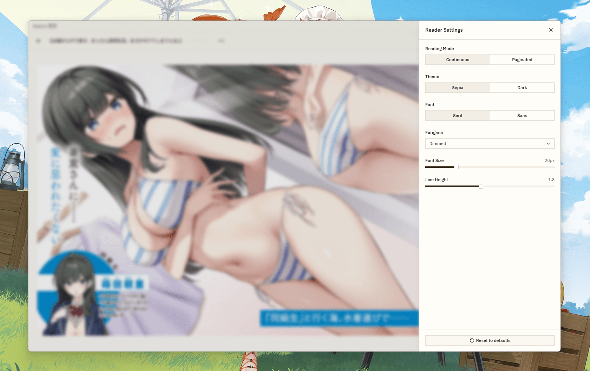
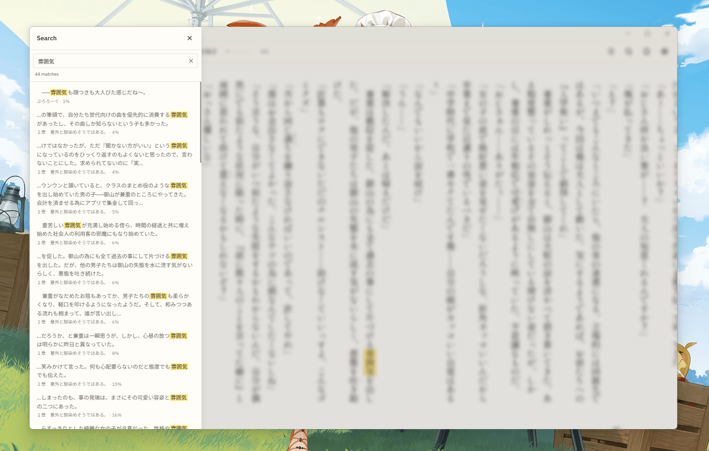

    

<h4 align="center">青空の下で、物語が始まる。</h4>

    
    

## About

**Aozora 青空**— is a desktop app **built for managing and reading Japanese light novel EPUBs** — tuned for
the things that matter when reading Japanese: tategaki, furigana,
and a comfortable paginated layout. Import your `.epub` library, then read with full
TOC navigation, bookmarks, in-book search, and adjustable typography.

> **Aozora** targets **Japanese light novel EPUBs specifically**. The parser
> and reader are built around the structure and styling conventions of those books
> (tategaki, ruby, image spreads). Other EPUBs may render incorrectly.

## Features

- **Two layout modes**, toggled live without re-parsing:
  - **Paginated** (default) — one column-page at a time, char-based paging.
  - **Continuous** — native scroll.
- **Furigana** rendered with native `<ruby>`, with five display modes: **show**, **hide**,
  **dimmed**, **toggle-on-click**, and **reveal-on-hover/click**.
- **Reading position** is tracked by character offset (`exploredCharCount`) at the
  viewport centre and restored on reopen — survives layout/font changes.
- **Table of contents** — jump to any chapter; the active chapter is highlighted.
- **Bookmarks** — multiple per book, with editable names (defaults to
  `{chapter} · {percent}%`); click to jump, delete on hover.
- **Full-text search** within the open book, with hit highlighting via the CSS
  Custom Highlight API (works across ruby and the paginated section swaps).
- **Display settings** (persisted): font size, line height, serif/sans Japanese font
  stack, sepia/dark theme, reading mode, furigana mode.

## Architecture

EPUBs are parsed **in the renderer** (Chromium has `DOMParser`, `Blob`,
`URL.createObjectURL`, IndexedDB): unzip → read `container.xml` + OPF
(manifest/spine/metadata) → flatten the whole spine into one HTML string (each chapter
wrapped in `
`), collecting images as blobs and concatenating
CSS. The reader renders that HTML inside
a **Shadow DOM** so book CSS can't leak into the app, and applies display settings
live via CSS custom properties on the shadow host.
