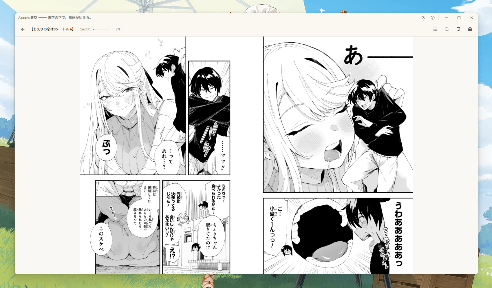
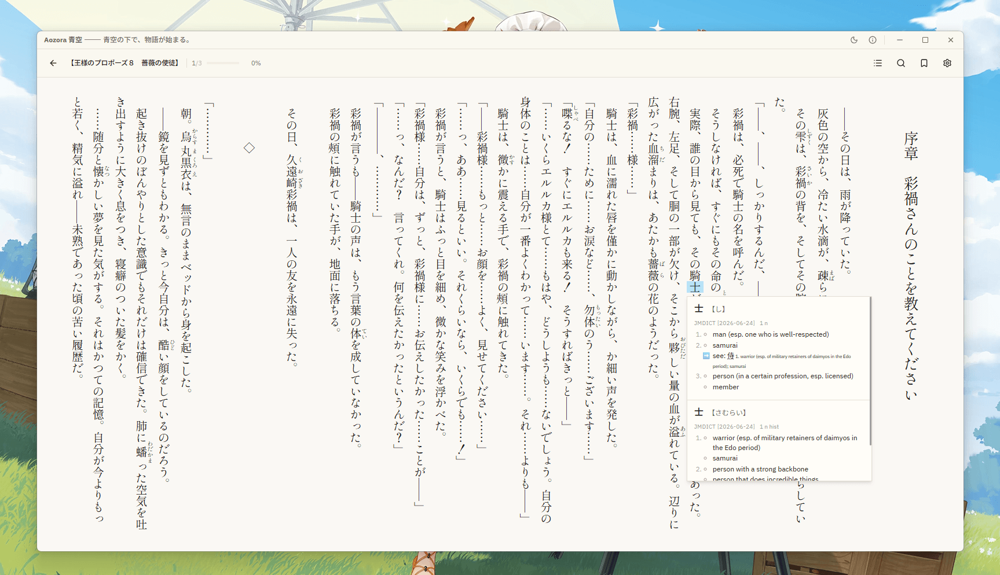

<p align="center">
    
</p>

<h4 align="center">青空の下で、物語が始まる。</h4>

<p align="center">
    
    
</p>

## About

**Aozora 青空** is a desktop EPUB reader made for reading Japanese light novels and manga. It renders Japanese the way it's written, **vertical tategaki or horizontal text** with **ruby furigana** in multiple display modes, and a built-in **[Yomitan dictionary](#dictionary)** turns any word into an instant hover lookup, complete with deinflection, pitch accent, and kanji breakdowns. Everything around the text is built for the long haul: full-text search, bookmarks, footnote popups, an illustration gallery, and a stats page that tracks every session.

> **Built for Japanese EPUB.** The parser and reader are tuned for the conventions of
> these books (tategaki, ruby, image spreads), so that's where Aozora shines. Other EPUBs
> still open and read fine — they just won't get the Japanese-specific handling.


## Features

- **Two layout modes**, toggled live without re-parsing:
  - **Paginated** (default) — page-flip layout, one column-page at a time, char-based paging.
  - **Continuous** — native scroll.
- **Vertical or horizontal text** — reads tategaki (vertical-rl) by default, following each
  book's own direction, with a live **Horizontal / Vertical** toggle in settings. Horizontal
  reading adds two layout controls: **columns per page** (paginated) and an adjustable
  **side margin** (continuous); both default to a sensible auto value.
- **Furigana** rendered with native `<ruby>`, with five display modes: **show**, **hide**,
  **dimmed**, **toggle-on-click**, and **reveal-on-hover/click**.
- **Footnote popups** — click a note reference and the footnote opens in a popup right
  where you are, instead of jumping to the end of the chapter.
- **Full-text search** within the open book, with hit highlighting via the CSS
  Custom Highlight API (works across ruby and the paginated section swaps).
- [**Dictionary**](#dictionary) — Yomitan-style pop-up lookup: hover a word, hold a modifier
  (Shift by default), and get deinflected entries from your imported Yomitan
  dictionaries — furigana headwords, structured glossaries (numbered senses, tables,
  ruby, images), frequency, pitch-accent graphs, and kanji breakdowns.
- [**Manga & fixed-layout**](#manga--fixed-layout) — image-per-page EPUBs render as true two-page spreads.
- **Illustration gallery** — browse every image in the book in a full-screen viewer
  (zoom, pan, thumbnail filmstrip) and jump to where an illustration appears in the text.
- **Reading statistics** — automatic session tracking feeds a stats page with a
  GitHub-style activity heatmap, daily goal, streaks, milestones and per-book
  totals.
- **Typography & themes** — adjustable font size and line height, **sepia / dark** themes,
  built-in Japanese fonts (Mincho, Noto Serif/Sans, gyōsho) plus **import your own**
  (TTF/OTF/WOFF/WOFF2).
- **Full-screen reading** — distraction-free mode via a header toggle or **F11**.
- **Discord Rich Presence** — show the book you're reading on your Discord profile with the Discord desktop app running.

  

## Manga & fixed-layout

Aozora's text reader follows the **ttsu (ッツ)** approach: the whole book is flattened
into one flowing document and reading position is a character offset, which is what
makes tategaki, live re-flow, and full-text search work so smoothly. That model is
built for **reflowable text** — a fixed-layout page (a full-page image) shows up as a
single standalone page, so manga read one page at a time with no real spreads.



Aozora adds a dedicated **fixed-layout path** on top, so image-per-page books read the
way they're meant to:

- **Detects fixed-layout books** declared `rendition:layout="pre-paginated"`, _and_
  **Open Manga Format (OMF)** books that reference page images directly from the spine
  (no XHTML wrapper).
- **Two-page spreads** — adjacent pages are paired into a spread honoring each page's
  `page-spread-left` / `-right` / `-center` and the book's
  `page-progression-direction` (right-to-left for Japanese manga). Covers and lone
  pages stay single.
- **Auto layout** — a two-page spread when the window is landscape, a single page when
  it's portrait; or force **Single** / **Spread** in settings.
- **Mixed books** — a light novel with embedded colour/illustration spreads: the prose
  flows as text while paired image pages render **side by side** in paginated mode.
  Search and character-offset progress keep working over the text; image pages simply
  contribute no characters.

## Dictionary

A built-in **hover dictionary with support for Yomitan dictionaries** lets you read with
instant lookups — no external app, no copy-paste. Hover a word in the reader and the
matching entry pops up right next to it.

- Open the **Dictionaries** page (sidebar) and **Import** one or more Yomitan
  dictionaries — `.zip` files in Yomitan/Yomichan **format v3**: JMdict, monolingual
  国語 dictionaries, frequency lists, pitch-accent dictionaries, KANJIDIC, and so on.
  Aozora ships no bundled dictionary; you bring your own.
- In the reader, **hover a word and hold the trigger key** — **Shift** by default,
  changeable to **Alt**, **Ctrl**, or **Hover only**. The matched run is highlighted
  and the popup stays **pinned** to the word, so you can move the cursor straight into
  it to scroll, copy, or read long entries without it jumping to another word.
- On the Dictionaries page you can toggle the whole feature, pick the trigger key,
  enable/disable each dictionary, and **reorder** them to set consult **priority**
  (higher dictionaries are shown first).



Each entry shows everything your dictionaries provide, rendered like Yomitan:

- **Furigana headwords** — the reading sits above the kanji as `<ruby>`, distributed
  per-segment so only the kanji carries furigana (食べる → 食[た]べる).
- **Structured glossaries** kept intact — numbered senses, lists, tables, ruby, and
  **embedded images** (e.g. stroke diagrams, pitch graphs) from the dictionary archive.
- **Frequency** badges, **pitch-accent** graphs (OJAD-style, with the downstep number),
  and **part-of-speech / commonness tags** colour-coded by category.
- **Kanji breakdown** — on/kun readings, meanings, stroke/grade/JLPT/frequency stats,
  and a kanji-only fallback when you hover a lone character.

Instead of a tokenizer, Aozora uses **rikai/Yomitan-style scanning**. For the text
starting at the cursor it tries successively shorter prefixes (longest first), runs
each through a **deinflection engine** — a direct port of Yomitan's ~140-rule Japanese
transform set — to recover candidate dictionary forms, then queries the enabled
dictionaries. A candidate only matches when its grammatical conditions are compatible
with the entry's part of speech, so a noun never matches a verb deinflection. The
longest prefix that hits anything wins, and its length drives the highlight. Inflected
words resolve to their dictionary form (e.g. 食べさせられた → 食べる) with the chain of
inflection reasons shown in the popup.

## Installation

### Download

Grab the latest installer from the
[**Releases**](https://github.com/meokisama/aozora/releases) page. On Windows, run the
`.exe` — the app installs and auto-updates on subsequent launches.

### Build from source

Requires **Node.js** and **Yarn**.

```bash
# Clone the repo
git clone https://github.com/meokisama/aozora.git
cd aozora

# Install dependencies
yarn install

# Run in development
yarn start

# Build a distributable installer (output in out/make/)
yarn make
```

## License

Aozora is licensed under the **GNU General Public License v3.0** (see [`LICENSE`](./LICENSE)).

It includes code ported from **[Yomitan](https://github.com/yomidevs/yomitan)**
(GPL-3.0) — the deinflection engine, the Japanese transform ruleset that power the hover dictionary. Yomitan dictionary files are created and
owned by their respective authors.
