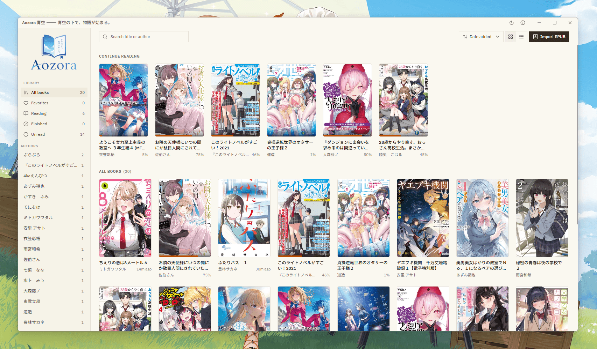
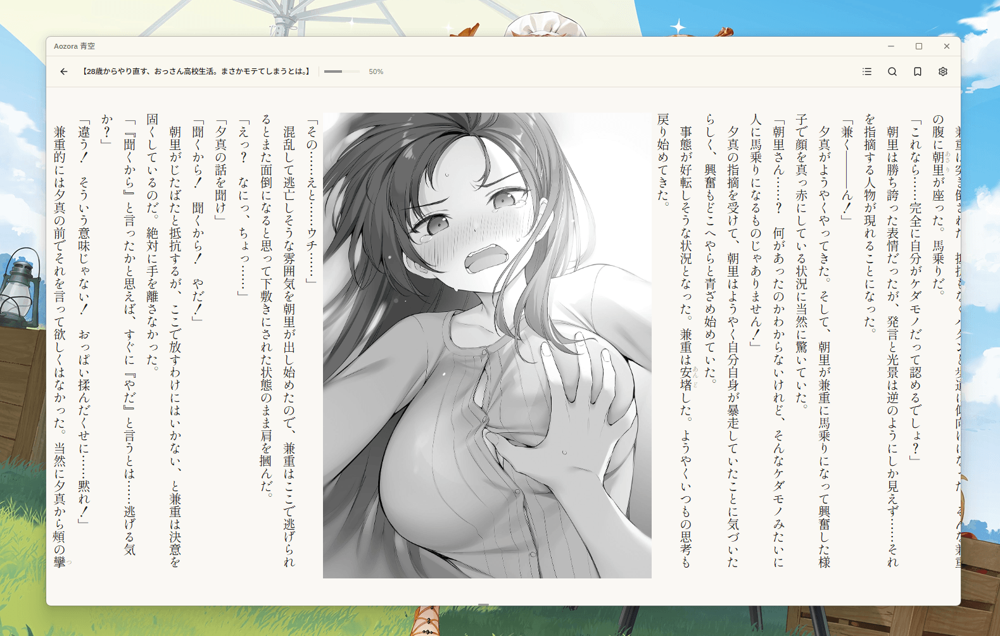
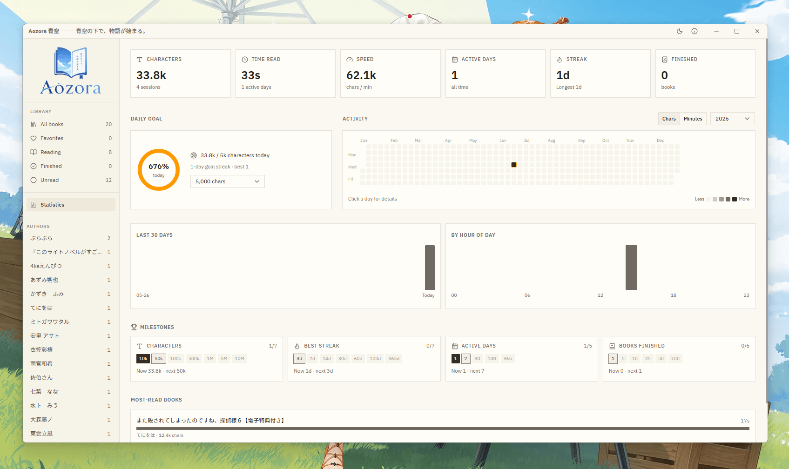

    

<h4 align="center">青空の下で、物語が始まる。</h4>

    
    

## About

**Aozora 青空**— is a desktop app **built for managing and reading Japanese light novel EPUBs** — tuned for
the things that matter when reading Japanese: tategaki, furigana,
and a comfortable paginated layout. Import your `.epub` library, then read with full
TOC navigation, bookmarks, in-book search, and adjustable typography.

It also reads **fixed-layout manga EPUB** as proper two-page spreads — see
[Manga & fixed-layout](#manga--fixed-layout) below.

> **Aozora** targets **Japanese EPUB specifically**. The parser
> and reader are built around the structure and styling conventions of those books
> (tategaki, ruby, image spreads). Other EPUBs may render incorrectly.

## Features

- **Two layout modes**, toggled live without re-parsing:
  - **Paginated** (default) — one column-page at a time, char-based paging.
  - **Continuous** — native scroll.
- **Furigana** rendered with native `<ruby>`, with five display modes: **show**, **hide**,
  **dimmed**, **toggle-on-click**, and **reveal-on-hover/click**.
- **Reading position** is tracked by character offset at the
  viewport centre and restored on reopen — survives layout/font changes.
- **Table of contents** — jump to any chapter; the active chapter is highlighted.
- **Bookmarks** — multiple per book, with editable names; click to jump, delete on hover.
- **Full-text search** within the open book, with hit highlighting via the CSS
  Custom Highlight API (works across ruby and the paginated section swaps).
- **Manga & fixed-layout** — image-per-page EPUBs render as true two-page spreads
  (see below).
- **Reading statistics** — automatic session tracking feeds a stats page with a
  GitHub-style activity heatmap, daily goal, streaks, milestones and per-book
  totals.
- **Display settings**: font size, line height, serif/sans Japanese font
  stack, sepia/dark theme, reading mode, furigana mode, manga page layout.

## Manga & fixed-layout

Aozora's text reader follows the **ttsu (ッツ)** approach: the whole book is flattened
into one flowing document and reading position is a character offset, which is what
makes tategaki, live re-flow, and full-text search work so smoothly. That model is
built for **reflowable text** — a fixed-layout page (a full-page image) shows up as a
single standalone page, so manga read one page at a time with no real spreads.

Aozora adds a dedicated **fixed-layout path** on top, so image-per-page books read the
way they're meant to:

- **Detects fixed-layout books** declared `rendition:layout="pre-paginated"`, _and_
  **Open Manga Format (OMF)** books that reference page images directly from the spine
  (no XHTML wrapper).
- **Two-page spreads** — adjacent pages are paired into a spread honoring each page's
  `page-spread-left` / `-right` / `-center` and the book's
  `page-progression-direction` (right-to-left for Japanese manga). Covers and lone
  pages stay single.
- **Auto layout** — a two-page spread when the window is landscape, a single page when
  it's portrait; or force **Single** / **Spread** in settings.
- **Mixed books** — a light novel with embedded colour/illustration spreads: the prose
  flows as text while paired image pages render **side by side** in paginated mode.
  Search and character-offset progress keep working over the text; image pages simply
  contribute no characters.

> Wholly-image manga have no text to search, so in-book search is disabled for them.

## Architecture

EPUBs are parsed **in the renderer** (Chromium has `DOMParser`, `Blob`,
`URL.createObjectURL`, IndexedDB): unzip → read `container.xml` + OPF
(manifest/spine/metadata) → flatten the whole spine into one HTML string (each chapter
wrapped in `
`), collecting images as blobs and concatenating
CSS. The reader renders that HTML inside
a **Shadow DOM** so book CSS can't leak into the app, and applies display settings
live via CSS custom properties on the shadow host.

Rendering then branches on the book's layout, all sharing that one OPF-parse layer:

- **Reflowable text** — the flattened HTML drives the continuous scroller or the
  column-based paginated controller; position is a global character offset.
- **Fixed-layout (manga)** — a dedicated viewer renders the page images as scaled
  two-page spreads (its own Shadow DOM, spread-index position).
- **Mixed** — a reflowable book with embedded fixed-layout image pages reuses the text
  reader, merging paired image sections into a single spread page.
