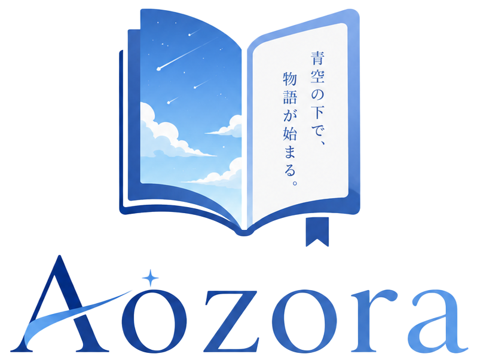
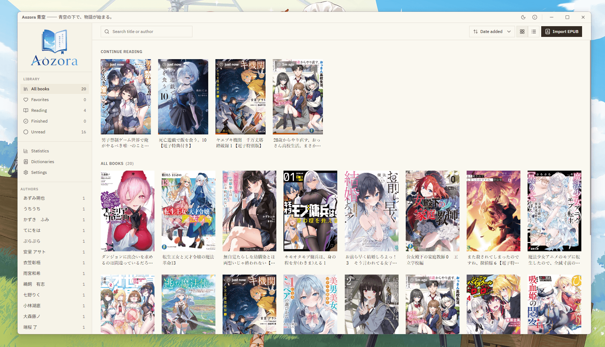
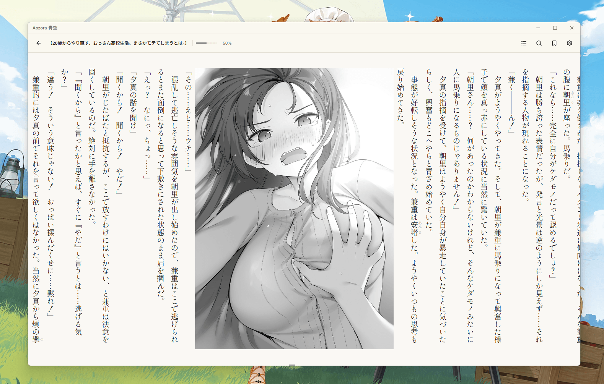
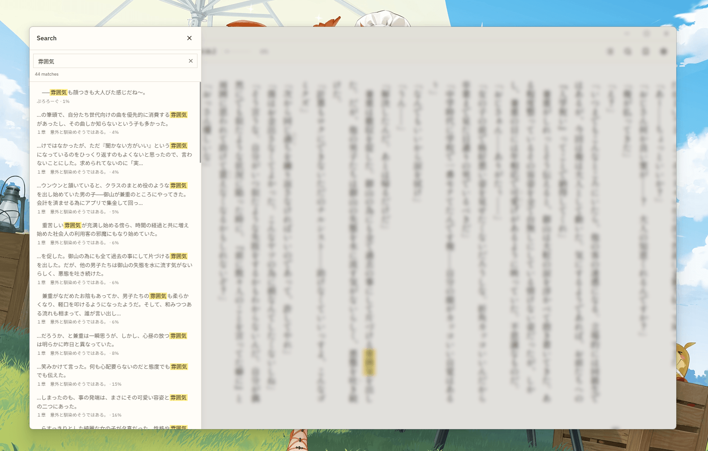
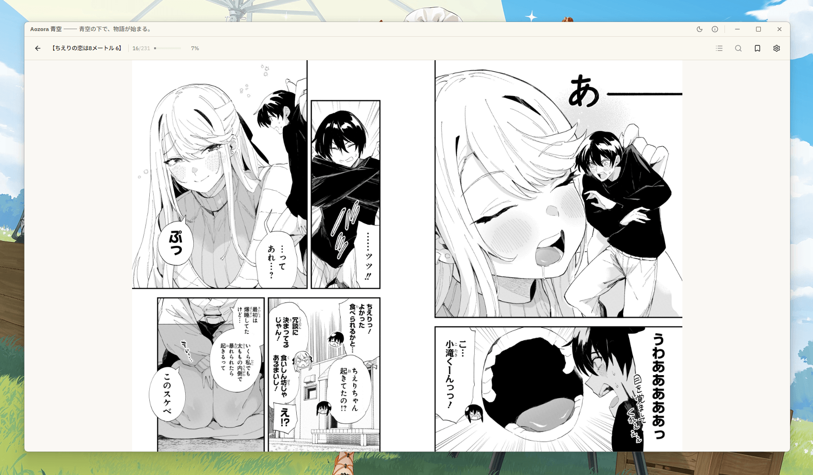
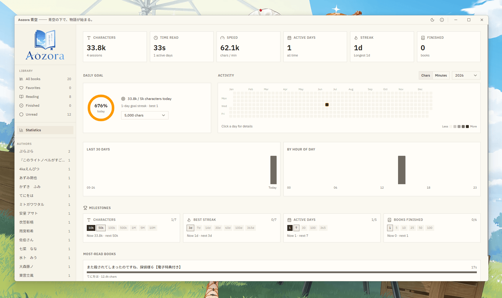
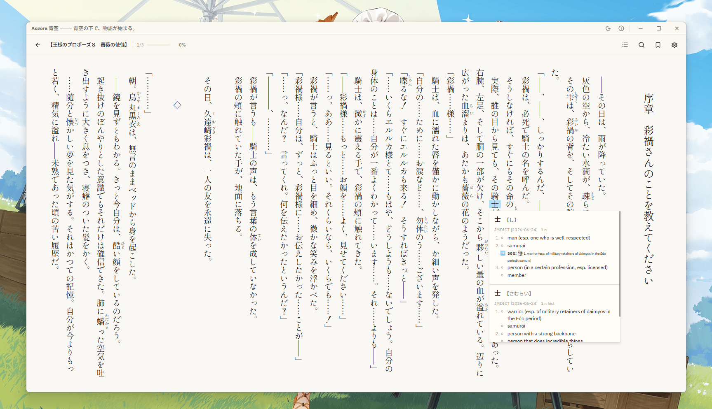

    

<h4 align="center">青空の下で、物語が始まる。</h4>

    
    

## Giới thiệu

**Aozora 青空** là trình đọc EPUB dành cho người học tiếng Nhật, được xây dựng chủ yếu để đọc light novel và manga, tích hợp sẵn các tính năng như **[từ điển Yomitan](#từ-điển)**, **[tạo flashcard cho Anki](#anki)**, **[giọng đọc waifu (TTS)](#voice-waifu-tts)** kèm highlight kiểu karaoke, tìm kiếm toàn văn, các thống kê đọc sách và rất nhiều tính năng khác.

> **Được xây dựng riêng cho EPUB tiếng Nhật.** Trình đọc được tinh chỉnh theo các quy ước của những EPUB này, các EPUB khác vẫn có thể mở và đọc bình thường nhưng có thể sẽ không hoạt động chính xác hay có đầy đủ tính năng như tiếng Nhật.

## Tính năng

- **Bố cục & hướng chữ linh hoạt**: Hỗ trợ xem dạng **Phân trang** (**Paginated**) hoặc **Cuộn liên tục** (**Continuous**), cùng các hướng chữ ngang hoặc dọc (tategaki - vertical-rl). Khi đọc chiều ngang, bạn có thể chỉnh số cột hiển thị trên mỗi trang (ở chế độ Phân trang) hoặc độ rộng hai bên lề (ở chế độ Cuộn).
- **Tùy chỉnh Furigana**: Hiển thị qua thẻ `<ruby>` với 5 chế độ tiện lợi: **Hiện**, **Ẩn**, **Hiện mờ**, **Hiện khi nhấp** hoặc **Hiện khi di chuột/nhấp**.
- **Xem chú thích dạng Popup**: Nhấp vào vị trí chú thích của tác giả để mở ngay một bảng nhỏ tại chỗ, không lo bị nhảy xuống cuối chương.
- **Tìm kiếm toàn văn**: Tra cứu nhanh bất kỳ từ khóa nào trong cuốn sách đang đọc.
- [**Từ điển tra nhanh**](#từ-điển): Rê chuột và giữ phím kích hoạt (mặc định là **Shift**) để bật bảng tra từ kiểu Yomitan. Hiển thị đầy đủ Furigana, bảng nghĩa có cấu trúc (số thứ tự, bảng biểu, hình ảnh), mức độ phổ biến, câu ví dụ, đồ thị trọng âm (pitch-accent) và phân tích Kanji.
- **Thư viện minh họa**: Xem toàn bộ hình ảnh trong sách ở chế độ toàn màn hình, hỗ trợ bấm vào ảnh để nhảy ngay đến vị trí trang tương ứng và tiếp tục đọc.
- **Thống kê tiến trình đọc**: Tự động ghi lại thời gian đọc và tổng hợp thành bảng thống kê trực quan, bao gồm bản đồ nhiệt (kiểu GitHub), chuỗi ngày đọc (streak), mục tiêu hằng ngày, các cột mốc đạt được và tổng thời gian đọc cho từng cuốn sách.
- **Chế độ đọc toàn màn hình**: Loại bỏ mọi xao nhãng chỉ với một cú nhấp vào nút trên thanh công cụ hoặc bấm phím **F11**.
- [**Tạo thẻ ghi nhớ Anki**](#anki): Tạo thẻ Anki tức thì ngay từ bảng tra từ điển thông qua **AnkiConnect**. Tự động gán các thông tin như từ vựng, cách đọc, định nghĩa, câu chứa từ và ảnh chụp đoạn văn vào đúng các trường trong ghi chú của bạn.
- [**Đọc từ vựng & câu văn bằng giọng waifu (TTS)**](#voice-waifu-tts): Lắng nghe phát âm tiếng Nhật tự nhiên qua công cụ **VOICEVOX**. Bạn có thể bấm vào biểu tượng loa ở mục từ điển để nghe từ đơn, hoặc giữ phím + di chuột để nghe cả câu kèm **hiệu ứng nổi bật chữ kiểu karaoke** chạy đồng bộ theo giọng đọc.
- **Hiển thị trạng thái Discord (Rich Presence)**: Tự động cập nhật tên cuốn sách bạn đang đọc lên hồ sơ Discord cá nhân.

  

## Từ điển

Một **từ điển tra nhanh hỗ trợ từ điển Yomitan** tích hợp sẵn cho phép bạn đọc với việc tra cứu
tức thì — không cần ứng dụng ngoài, không cần sao chép-dán. Di chuột lên một từ trong trình đọc
và mục từ tương ứng sẽ bật lên ngay bên cạnh.

- Để sử dụng, vào mục **Dictionaries** trên thanh bên và chọn **Import** để thêm từ điển. Công cụ hỗ trợ các tệp `.zip` theo chuẩn v3 của Yomitan/Yomichan như: JMdict, Jitendex,... Lưu ý rằng ứng dụng không có sẵn dữ liệu từ điển, bạn cần tự tải và thêm từ điển của mình vào hoặc cài các từ điển được recommend sẵn trong đó.
- Tại trang **Dictionaries**, bạn có thể bật/tắt toàn bộ tính năng tra từ, đổi phím kích hoạt, bật/tắt riêng từng từ điển, và kéo thả sắp xếp thứ tự để đặt mức ưu tiên (từ điển nằm ở trên sẽ được hiển thị kết quả trước).

Mỗi từ hiển thị đầy đủ mọi thông tin từ bộ từ điển của bạn, trình bày chuẩn theo giao diện của Yomitan:

- Phần tiêu đề từ có gắn furigana, phiên âm đặt ngay trên chữ Hán theo dạng <ruby>, được phân bổ chính xác theo từng chữ Hán (ví dụ: 食べる → 食[た]べる).
- Bảng giải nghĩa giữ nguyên cấu trúc gốc từ dữ liệu từ điển — bao gồm số thứ tự, danh sách, bảng biểu, phiên âm và cả hình ảnh đính kèm (như sơ đồ nét chữ, đồ thị trọng âm).
- Các nhãn tần suất, đồ thị trọng âm (kiểu OJAD kèm số hạ giọng) và nhãn từ loại / độ phổ biến đều được tô màu rõ ràng theo từng danh mục.
- Bạn cũng có thể xem phân tích chi tiết Kanji (âm On/Kun, ý nghĩa, số nét, cấp độ JLPT/lớp học, tần suất) hoặc di chuột vào từng chữ Hán đơn lẻ để tra nhanh.

Thay vì dùng bộ tách từ (tokenizer), Aozora sử dụng cơ chế quét từ tương tự Rikai/Yomitan. Bắt đầu từ vị trí con trỏ, ứng dụng sẽ thử từng cụm từ dài nhất có thể, sau đó thu ngắn dần và đưa qua hệ thống xử lý biến dạng từ — tích hợp sẵn khoảng 140 quy tắc ngữ pháp tiếng Nhật của Yomitan. Hệ thống này giúp khôi phục các từ đã chia về dạng nguyên mẫu rồi mới tìm trong từ điển. Một từ chỉ được coi là khớp khi đúng cả dạng ngữ pháp lẫn từ loại (ví dụ: danh từ sẽ không bao giờ bị nhầm với động từ đã chia). Cụm từ dài nhất tìm thấy kết quả sẽ được ưu tiên hiển thị và làm nổi bật. Các từ đã chia (như 食べさせられた) sẽ được đưa về dạng nguyên mẫu (食べる) kèm theo giải thích chi tiết các bước chia từ ngay trong bảng tra cứu.

## Anki

Tạo thẻ ghi nhớ (flashcard) từ những từ bạn vừa tra cứu ngay trong trình đọc mà không cần chuyển ứng dụng. Aozora kết nối với Anki thông qua add-on AnkiConnect. Mỗi mục từ hiển thị một nút **＋ Anki**; chỉ với một cú nhấp, thẻ mới sẽ được tự động tạo từ chính nội dung đang hiển thị trên màn hình.

**Cài đặt (chỉ làm một lần):** Cài add-on AnkiConnect trong Anki, khởi động lại Anki và giữ ứng dụng luôn chạy, sau đó vào **Aozora Settings → Anki**:

1. Bật tính năng tích hợp và nhấn **Test** để kết nối (thao tác này sẽ tải danh sách bộ thẻ và loại ghi chú của bạn).
2. Chọn bộ thẻ (**Deck**) và loại ghi chú (**Note type**) mong muốn, sau đó gán (map) từng trường của ghi chú với thông tin tương ứng. Aozora sẽ tự động gợi ý các giá trị mặc định dựa trên tên trường (ví dụ: trường `Sentence` → câu văn, `Meaning` → định nghĩa).
3. Tùy chỉnh các thiết lập khác: thêm thẻ tag, bật/tắt chế độ chống trùng lặp thẻ, và bật/tắt tính năng chụp màn hình (có thể điều chỉnh chất lượng ảnh).

**Các nội dung bạn có thể gán vào một trường (field):**

| Thẻ dữ liệu                  | Nội dung được chèn                                                           |
| :--------------------------- | :--------------------------------------------------------------------------- |
| **Word / Reading**           | Tiêu đề từ trong từ điển và cách đọc Kana tương ứng.                         |
| **Furigana**                 | Cách đọc đặt trên chữ Hán, dạng `<ruby>` hoặc `漢字[かんじ]`.                |
| **Definition**               | Phần giải nghĩa (giữ nguyên định dạng HTML hoặc chuyển thành văn bản thuần). |
| **Sentence**                 | Toàn bộ câu chứa từ cần tra (không kèm furigana).                            |
| **Pitch accent / Frequency** | Số hạ giọng (downstep) và mức độ phổ biến/tần suất xuất hiện của từ.         |
| **Book title / Book author** | Thông tin chi tiết (metadata) của cuốn sách đang đọc.                        |
| **Screenshot**               | Ảnh chụp màn hình đoạn văn bản, cắt theo đúng đoạn chứa câu ví dụ.           |

**Tạo thẻ (Mining):** Khi đang đọc, bạn di chuột vào từ cần tra và giữ phím kích hoạt như bình thường, sau đó nhấp vào nút **＋ Anki** trong bảng tra cứu. Nút sẽ chuyển thành dấu tích xanh khi thẻ được thêm thành công; nếu từ đã tồn tại (và bạn chọn ngăn tạo trùng), hệ thống sẽ báo lại. Tên cuốn sách cũng được tự động thêm làm thẻ tag, giúp các thẻ ghi nhớ luôn được nhóm gọn gàng theo từng nguồn sách.

## Voice waifu (TTS)

Aozora có thể đọc đoạn văn tiếng Nhật bạn đang xem, từ một từ đơn lẻ cho đến cả câu hoàn chỉnh, thông qua công cụ đọc **[VOICEVOX](https://voicevox.hiroshiba.jp/)**.

**VOICEVOX** là phần mềm chuyển văn bản thành giọng nói tiếng Nhật miễn phí với dàn giọng nhân vật rất sống động và tự nhiên (như Zundamon, Shikoku Metan,...). Phần mềm **chạy hoàn toàn trên máy tính của bạn**: không cần tài khoản, không phụ thuộc vào kết nối mạng và không dữ liệu nào bị gửi ra ngoài. Khi khởi chạy, phần mềm sẽ tạo một máy chủ nội bộ nhỏ để Aozora kết nối. Nhờ đó, chất lượng giọng đọc vượt trội hơn hẳn so với giọng đọc mặc định của trình duyệt. Lưu ý rằng Aozora **sử dụng độc quyền VOICEVOX** cho tính năng đọc thành tiếng (không dùng các công cụ thay thế chất lượng thấp hơn), nên đây là ứng dụng bắt buộc nếu bạn muốn nghe đọc.

**Cài đặt (chỉ làm một lần):** Tải và mở **VOICEVOX** từ trang [voicevox.hiroshiba.jp](https://voicevox.hiroshiba.jp/), sau đó vào **Aozora Settings → Read aloud**:

- **Bật** tính năng đọc thành tiếng và nhấn **Test** để kết nối với phần mềm (địa chỉ mặc định là `http://127.0.0.1:50021`). Thao tác này sẽ tải danh sách các giọng đọc hiện có.
- Chọn **giọng đọc** và **tốc độ đọc** mong muốn. Bạn có thể nhấn nút nghe thử để kiểm tra.
- Chọn phím tắt cho tính năng **Đọc**: mặc định là **Alt** (hoặc có thể đổi thành **Ctrl** / **Shift**). Phím này độc lập với phím tra từ điển để tránh bị xung đột khi thao tác.

<video src="https://github.com/user-attachments/assets/29e5493c-92c6-4ee5-b102-ad7f5a340336" controls width="100%"></video>

Hai cách phát âm thanh ngay trong trình đọc:

- **Đọc từ đơn:** Trong bảng tra từ điển, nhấn vào biểu tượng 🔊 ở bất kỳ mục từ nào để nghe cách đọc của từ đó.
- **Đọc cả câu:** **Giữ phím tắt đọc câu và di chuột vào câu văn**; một nút **Read sentence** sẽ xuất hiện ngay cạnh con trỏ. Nhấp vào nút này, Aozora sẽ đọc toàn bộ câu văn đồng thời **làm nổi bật chữ theo nhịp đọc (kiểu karaoke)** dựa trên mốc thời gian phát âm của VOICEVOX. Hiệu ứng nổi bật chỉ áp dụng cho văn bản gốc, không đè lên phần furigana phía trên.
